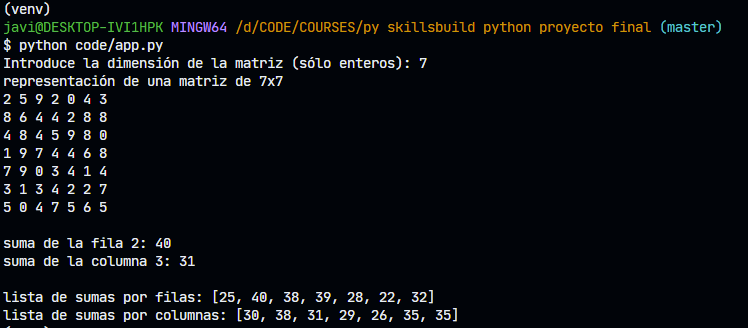

# Curso Python Full Stack (IBM SkillsBuild & Bejob) Caso Práctico Final

[enlace a github](https://github.com/jdelarubia/py-skillsbuild-python-proyecto-final)

---

## Requerimientos

Escribir un programa en Python que genere una matriz de tamaño NxN y la llene con números aleatorios entre 0 y 9. El programa deberá imprimir la matriz generada y luego calcular la suma de los elementos de cada fila y columna. Finalmente, deberá imprimir la suma de cada fila y columna.

El programa deberá incluir las siguientes características:

-   [x] **Generación de la matriz**: El programa deberá generar una matriz cuadrada de tamaño NxN, donde N es un número entero ingresado por el usuario.
-   [x] **Rellenar la matriz con números aleatorios**: El programa deberá rellenar la matriz con números aleatorios entre 0 y 9.
-   [x] **Imprimir la matriz**: El programa deberá imprimir la matriz generada en pantalla.
-   [x] **Calcular la suma de cada fila y columna**: El programa deberá calcular la suma de los elementos de cada fila y columna y almacenarlas en dos listas.
-   [x] **Imprimir la suma de cada fila y columna**: El programa deberá imprimir en pantalla la suma de cada fila y columna.

Además, se sugiere que el programa incluya manejo de excepciones en caso de que el usuario ingrese un valor no válido para N, también que incluya comentarios para explicar el código y finalmente que se hagan los test unitarios necesarios para asegurar que el resultado es el esperado.

---

## Ejecución

```bash
# Correr las pruebas
python -m unittest tests.test_matrix -v

# Correr el código de ejemplo
python code/app.py
```

---

## Resultado



---

## Recursos

-   [Python unittest official](https://docs.python.org/3/library/unittest.html)
-   [A beginner's guide to Python unittest](https://www.dataquest.io/blog/unit-tests-python/)
-   [Python random module](https://docs.python.org/3/library/random.html)
-   [Python properties: getters and setters](https://realpython.com/python-property/)
-   [Using the len() function in Python](https://realpython.com/len-python-function/)

---

## Ideas para mejoras

-   probar programación más defensiva. Comprobar tipos de los argumentos pasados a algunos métodos
-   probar que se lanzan las excepciones correspondientes en los tests cuando pasamos valores de tipos incorrectos.
-   probar que los valores pasados son enteros positivos o lanzar excepción
-   permitir pasar un limite_inferior y un limite_superior a los límites de los números aleatorios a generar.
